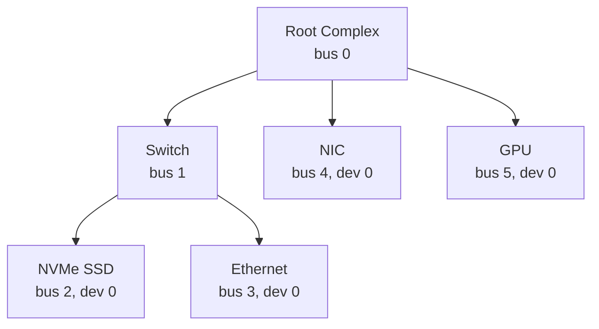

**Topology** = the physical/logical shape of how PCIe devices connect to each other. In PCIe specifically: a tree rooted at the Root Complex (CPU/memory interface), branching through optional Switches (each with one upstream port and multiple downstream ports), terminating in Endpoints (NICs, GPUs, NVMe drives, etc.) or Bridges to other buses. Enumeration is the software process (BIOS/OS) walking that tree via config-space reads to discover bus/device/function numbers and assign resources.

Example Flow:

Edit node labels/structure however you like (add more switches, nested branches, multi-function devices like `dev 0, fn 0/1`). When you paste your version back, I'll check it for structural issues (e.g., switch needing exactly one upstream port, valid bus numbering, dangling nodes) and convert it into a YAML device tree for your sim.

Paste your mermaid whenever it's ready.